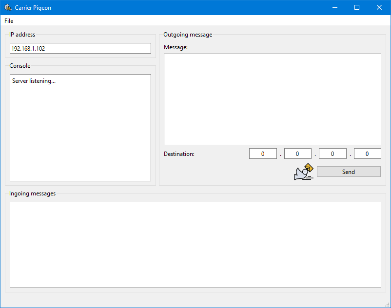

# carrier_pigeon

## Description
**Carrier Pigeon** is a peer-to-peer application that allows to exchange text messages between hosts in the same subnet.

The software was created with the aim of allowing rapid disposable communications between hosts in a private environment without using the Internet. Therefore hosts are identified by IP address and messages are not stored on disk in any way.

Carrier Pigeon contains:
* the executable Carrier Pigeon.

At the first start, the software automatically chooses an IP address (shown in the *IP address* panel) to listen to incoming messages. The default port is 50000. 
The user enters the message to be sent in the *Message* field and the recipient's IP address. 
Copy and paste can be used. 
By clicking on *Send*, Carrier Pigeon attempts to connect to the designated IP address to send the message. The default timeout is 10000 ms. 
The result of the operation is shown in the *Console* panel. 
In the settings the user can change port, timeout and, if there are multiple network interfaces, the listening IP address. 
In case of change of subnet or network interfaces, it is necessary to select the new IP address in the settings.

## Requirements
* Windows 10 or later
* Mac OS 11 (Big Sur) or later.

## Installation
Just put Carrier Pigeon where you want.

## Usage
1. Double-click on Carrier Pigeon
2. Write the message to send
3. Enter the recipient's IP address
4. Send the message by clicking on *Send*
5. Read received messages in the *Ingoing messages* panel.

## Credits
Developed by Federico Cipressi with Qt framework. 
<a href="https://www.flaticon.com/free-icons/carrier-pigeon" title="carrier pigeon icons">Carrier Pigeon icons created by Nikita Golubev - Flaticon</a>

## Contributing
If you have ideas, improvements or proposals, feel free to open an issue or a pull request.
